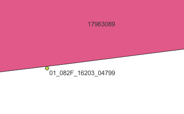

## 2 Different Intersection Methods

Terra raster intersection vs PosgreSQl st_contains vector intersection


Note that Terra method has some issues:

- handling of NULLs in GDB is inconsistent (0 and NaN are used)
- process takes almost 32GB to complete

- while faster, it might be best to use the st_contains8


```{r read_data, echo=FALSE, message=FALSE, warning=FALSE}


year <- '2022'

library(RPostgreSQL)
library(tidyverse)
library(kableExtra)


# set up for load to PostgreSQL
schema <- paste0('msyt_',year)
opt <- paste0("-c search_path=",schema)
user_name <- 'results'
database <- 'msyt'
con <- dbConnect('PostgreSQL',dbname=database,user=user_name,options=opt)


```


## row count from source


```{r row_counts, eval = TRUE,echo=FALSE, message=FALSE, warning=FALSE}


# NULL si values

  
  q1 <- 'select count(*) as n1 , unit_no from pspl_fid_merged where (at_si >0 or ba_si >0 or bg_si >0 or bl_si >0 or cw_si >0 	or dr_si>0 or ep_si >0 or fd_si >0 or hm_si >0 or hw_si >0 	or lt_si >0 or lw_si >0 or pa_si >0 or pl_si >0 or pw_si >0 	or py_si >0 or sb_si >0 or se_si >0 or ss_si >0 or sw_si >0 or sx_si >0 or yc_si > 0)  group by 2 order by 2'


z1  <- dbGetQuery(con,q1)

q1 <- 'select count(*) as n1 , unit_no from pspl_terra_intersected where (at_si >0 or ba_si >0 or bg_si >0 or bl_si >0 or cw_si >0 	or dr_si>0 or ep_si >0 or fd_si >0 or hm_si >0 or hw_si >0 	or lt_si >0 or lw_si >0 or pa_si >0 or pl_si >0 or pw_si >0 	or py_si >0 or sb_si >0 or se_si >0 or ss_si >0 or sw_si >0 or sx_si >0 or yc_si > 0)  group by 2 order by 2'

z2  <- dbGetQuery(con,q1)


dbDisconnect(con)

names(z1) <- c('n1','unit_no')
names(z2) <- c('n2','unit_no')

c <- left_join(z1,z2)%>% select(unit_no,n1,n2)


c$diff <- as.integer(c$n2) -as.integer(c$n1)

names(c) <- c('Unit','st_contains n','terra n','Diff')


kable(c,format='markdown')

```

Table 1. Intersection Method compare

Note that there are 6 more intersected points in the Terra method.  

This is due to raster vs vector processing.

Example:




