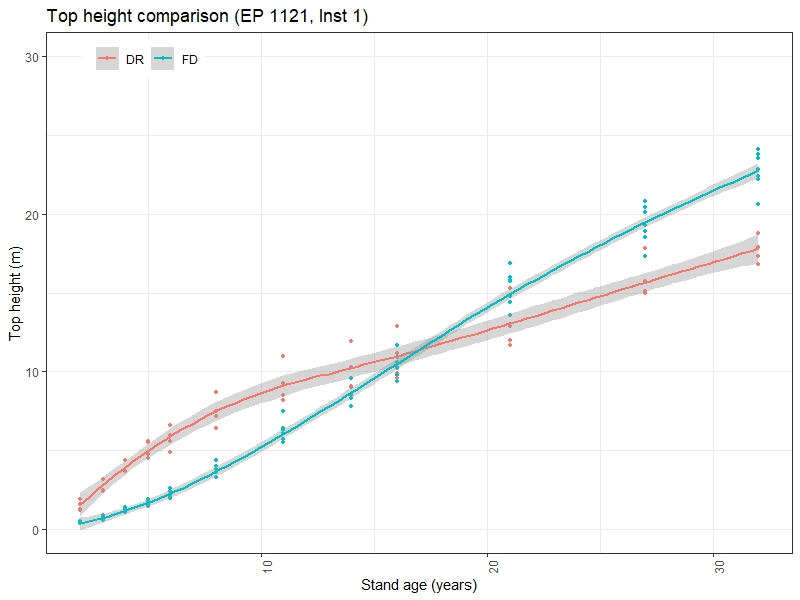

# PSPL Site Index Conversion

After the mean site index values have been assigned, there can be species that have missing site index values.  This will be discussed in more formal documentation.  But for processing requirements we need to fill in missing values where possible using a formalized set of site index conversions.  

Create the following tables:   

- pspl_site_index_bec
- pspl_site_index_fid
- pspl_site_index_op

## One to one conversions 

Ba / Bg / Bl interchangeable  
Pw / Ss interchangeable  
Lt / Lw interchangeable  
Hm /Hw interchangeable  
Pa / Pl interchangeable  

## Spruce Se Sw Sx

Assume that missing values in the Se Sw and Sx can all be interchanged

## Py

Where Py is in the SBS, can substitute Fd site index.  

Augmented this to substitute Fd site index anywhere Py site index is missing.

## Alder (Coast)

Use fdc site index as the alder site index seems to be generally missing from PSPL.

### Alternative

George Harper has proposed that using the Fir site index may be giving a siteindex that is too high.  

He suggested using:  

For Coastal BEC and subzones: ds, db, xm  

dr_si = fd_si \* 0.55   

For all other subzones:  

dr_si = fd_si \* 0.73

Sharad Baral produced the following height comparison:

  

## Conversions based on Sindex

The following table documents the conversions coefficients.

The conversion equation is of the form:

s1si = b0 + b1 \* s2si 

|s1|s2|b0|b1|
|--|--|------------|-----------|
|at|sw|-4.768112309|1.253446979|
|at|sx|-4.768112309|1.253446979|
|at|se|-4.768112309|1.253446979|
|at|bl|-7.216706405|1.457496490|
|at|pl|-7.452123778|1.362442366|
|at|fd|-12.846637615|1.700742166|
|ba|hw|-1.977317550|0.986193290|
|ba|ss|1.928007878|0.789940825|
|ba|sx|1.928007878|0.789940825|
|ba|cw|-0.738658778|1.033530568|
|ba|fd|-2.403353051|0.886587768|
|bl|sw|1.680000000|0.860000000|
|bl|sx|1.680000000|0.860000000|
|bl|pl|0.474311930|0.917431190|
|bl|at|4.951440000|0.686108000 |
|bl|fd|-0.221100912|0.981651373|
|bl|lw|-1.360550450|0.954128438|
|bl|sb|-3.497247692|1.436697244|
|cwc|hw|-1.198473280|0.95419847|
|cwc|ba|0.714694652|0.967557249|
|cwc|ss|2.580152661|0.764312974|
|cwc|sx|2.580152661|0.764312974|
|cwc|fd|-1.610687019|0.857824425|
|fdc|hw|0.480533930|1.112347050|
|fdc|cw|1.877641825|1.165739708|
|fdc|ba|2.710789765|1.127919909|
|fdc|ss|4.885428248|0.890989987|
|fdc|sx|4.885428248|0.890989987|
|fdi|pl|0.708411210|0.934579440|
|fdi|bl|0.225233640|1.018691590|
|fdi|hw|4.560000000|0.887000000|
|fdi|sw|4.750000000|0.737000000|
|fdi|sx|4.750000000|0.737000000|
|fdi|at|7.553548000|0.587978600|
|fdi|lw|-0.690000000|0.983000000| 
|fdi|sb|-3.337383186|1.463551403 |
|hwc|cw|1.256000000|1.048000000|
|hwc|ba|2.005000000|1.014000000|
|hwc|ss|3.960000000|0.801000000|
|hwc|sx|3.960000000|0.801000000|
|hwc|fd|-0.432000000|0.89900000|
|hwi|fd|-5.140924460|1.127395720|
|hwi|sw|0.214205210|0.830890646|
|hwi|sx|0.214205210|0.830890646|
|hwi|pl|-4.342264694|1.053640861|
|hwi|lw|-5.918827507|1.108229993|
|lw|fd|0.701932860|1.017294000|
|lw|bl|1.425961536|1.048076921|
|lw|pl|1.923076920|0.961538460|
|lw|sw|3.817307686|0.884615383|
|lw|sx|3.817307686|0.884615383|
|lw|hw|5.340793500|0.902339778|
|lw|sb|-2.239423073|1.505769228|
|pl|sw|1.970000000|0.920000000|
|pl|sx|1.970000000|0.920000000|
|pl|hw|4.121200000|0.949090000|
|pl|at|5.469680000|0.733976000|
|pl|bl|-0.517000000|1.090000000|
|pl|fd|-0.758000000|1.070000000|
|pl|lw|-2.000000000|1.040000000|
|pl|sb|-4.329000000|1.566000000|
|sb|pl|2.764367820|0.638569600|
|sb|lw|1.487228620|0.664112384|
|sb|fd|2.280332063|0.683269472 |
|sb|bl|2.434227337|0.696040864|
|sb|sw|4.022349932|0.587484032|
|sb|sx|4.022349932|0.587484032|
|ss|hw|-4.943820220|1.248439450|
|ss|ba|-2.440699123|1.265917602|
|ss|cw|-3.375780271|1.308364544|
|ss|fd|-5.483146062|1.122347066|
|sw|pl|-2.141304350|1.086956520|
|sw|at|3.804000000|0.797800000|
|sw|hw|-0.257801914|1.203527813|
|sw|bl|-1.953488370|1.162790700|
|sw|lw|-4.315217390|1.130434781|
|sw|fd|-6.445047490|1.356852100|
|sw|sb|-6.846739125|1.702173910|

## Changes to Site Index Converion Methods

### v0

- Direct translation of C code to R
- used cascade type if then else
- augmented site conversions for those not in the original C code

### v1

- transform form if then else to case_when
- cleaner code
- yield exactly the same result over 4.7M rows when comapred to v0

### v2a

- applied spruce site index conversion as first step
	- Sw_si = Sx_si where Sw_si = 0 and Sx_si > 0
- this only impacts Sw

### v2b

- applied the one to one conversions first
- applied spruce site index conversion as second step
	- Sw_si = Sx_si where Sw_si = 0 and Sx_si > 0
- this only impacts Sw
	