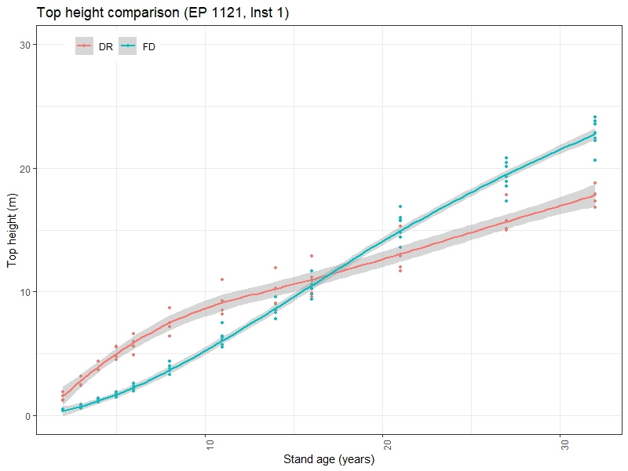

# PSPL Site Index Conversion

___

Author: Dave Waddell  
Date: 2023_feb_13

___

After the mean site index values have been assigned, there can be species that have missing site index values.  We need to fill in missing values where possible using a formalized set of site index conversions.  

Create the following tables:   

- pspl_site_index_fid
- pspl_site_index_bec

The following steps document the order of processing to obtain full site index values for all species that require a site index value. 

## Step 1: Initial One to one conversions before running formal conversions equations

An initial assessment of species missing site index values shows the majority to be either Spruce or White pine. So some one to one conversions are run.

| Species with missing si | Substitute from |
|:-----|:----|
| Sw | Sx|
| Sw | Se |
| Se | Sw |

These conversions can probably be tuned more to BEC but for now a brute force conversion is run.  

## Step 2: Conversions based on Sindex

SIndex contains a set of conversion equations.  These equations were directly translated from C to R.  

The following table documents the conversions coefficients. 

The conversion equation is of the form:

s1si = b0 + b1 \* s2si 

|s1|s2|b0|b1|
|--|--|------------|-----------|
|at|sw|-4.768112309|1.253446979|
|at|sx|-4.768112309|1.253446979|
|at|se|-4.768112309|1.253446979|
|at|bl|-7.216706405|1.457496490|
|at|pl|-7.452123778|1.362442366|
|at|fd|-12.846637615|1.700742166|
|ba|hw|-1.977317550|0.986193290|
|ba|ss|1.928007878|0.789940825|
|ba|sx|1.928007878|0.789940825|
|ba|cw|-0.738658778|1.033530568|
|ba|fd|-2.403353051|0.886587768|
|bl|sw|1.680000000|0.860000000|
|bl|sx|1.680000000|0.860000000|
|bl|pl|0.474311930|0.917431190|
|bl|at|4.951440000|0.686108000 |
|bl|fd|-0.221100912|0.981651373|
|bl|lw|-1.360550450|0.954128438|
|bl|sb|-3.497247692|1.436697244|
|cwc|hw|-1.198473280|0.95419847|
|cwc|ba|0.714694652|0.967557249|
|cwc|ss|2.580152661|0.764312974|
|cwc|sx|2.580152661|0.764312974|
|cwc|fd|-1.610687019|0.857824425|
|fdc|hw|0.480533930|1.112347050|
|fdc|cw|1.877641825|1.165739708|
|fdc|ba|2.710789765|1.127919909|
|fdc|ss|4.885428248|0.890989987|
|fdc|sx|4.885428248|0.890989987|
|fdi|pl|0.708411210|0.934579440|
|fdi|bl|0.225233640|1.018691590|
|fdi|hw|4.560000000|0.887000000|
|fdi|sw|4.750000000|0.737000000|
|fdi|sx|4.750000000|0.737000000|
|fdi|at|7.553548000|0.587978600|
|fdi|lw|-0.690000000|0.983000000| 
|fdi|sb|-3.337383186|1.463551403 |
|hwc|cw|1.256000000|1.048000000|
|hwc|ba|2.005000000|1.014000000|
|hwc|ss|3.960000000|0.801000000|
|hwc|sx|3.960000000|0.801000000|
|hwc|fd|-0.432000000|0.89900000|
|hwi|fd|-5.140924460|1.127395720|
|hwi|sw|0.214205210|0.830890646|
|hwi|sx|0.214205210|0.830890646|
|hwi|pl|-4.342264694|1.053640861|
|hwi|lw|-5.918827507|1.108229993|
|lw|fd|0.701932860|1.017294000|
|lw|bl|1.425961536|1.048076921|
|lw|pl|1.923076920|0.961538460|
|lw|sw|3.817307686|0.884615383|
|lw|sx|3.817307686|0.884615383|
|lw|hw|5.340793500|0.902339778|
|lw|sb|-2.239423073|1.505769228|
|pl|sw|1.970000000|0.920000000|
|pl|sx|1.970000000|0.920000000|
|pl|hw|4.121200000|0.949090000|
|pl|at|5.469680000|0.733976000|
|pl|bl|-0.517000000|1.090000000|
|pl|fd|-0.758000000|1.070000000|
|pl|lw|-2.000000000|1.040000000|
|pl|sb|-4.329000000|1.566000000|
|sb|pl|2.764367820|0.638569600|
|sb|lw|1.487228620|0.664112384|
|sb|fd|2.280332063|0.683269472 |
|sb|bl|2.434227337|0.696040864|
|sb|sw|4.022349932|0.587484032|
|sb|sx|4.022349932|0.587484032|
|ss|hw|-4.943820220|1.248439450|
|ss|ba|-2.440699123|1.265917602|
|ss|cw|-3.375780271|1.308364544|
|ss|fd|-5.483146062|1.122347066|
|sw|pl|-2.141304350|1.086956520|
|sw|at|3.804000000|0.797800000|
|sw|hw|-0.257801914|1.203527813|
|sw|bl|-1.953488370|1.162790700|
|sw|lw|-4.315217390|1.130434781|
|sw|fd|-6.445047490|1.356852100|
|sw|sb|-6.846739125|1.702173910|

## Step 3: BEC mean site index substitution

After running the SIndex conversions there are still species missing site index values.  

It has been recommended that the SIndex conversion equations only be run once (Gord Night).  

The BEC mean site index values are then used to fill missing required site index for species.  

For AR2022 this left the following species with missing SiteIndex:

|missing  |   n|
|:--|:--|
|Pw 10356|
|Lw    73|
|Lt    51|
|Ba    14|
|Bg     8|
|Dr     1|

### Processing Order notes

The SIndex coefficients are processed in alphabetical order (sort of) and they are run only once.  
The BEC substitutions are then used to fill in gaps, but in the case of Pw for example, Pw doesn't get a site index but Ss does.  

So the SIndex conversions must be run a second time for the reduced subset with missing site index values. 

## Site Index Conversions not in Sindex

### Alder

George Harper has proposed that using the Fir site index may be giving a siteindex that is too high.  

He suggested using:  

For Coastal BEC and subzones: ds, db, xm  

dr_si = fd_si \* 0.55   

For all other subzones:  

dr_si = fd_si \* 0.73

Sharad Baral produced the following height comparison:

  

___

### Interior Cwi

For missing values, substitute: Sw  

Added to SIndex coefficient table

___

### Py

Where Py is in the SBS, can substitute Fd site index.  
Augmented this to substitute Fd site index anywhere Py site index is missing.

___

### Balsam
Ba / Bg / Bl interchangeable  

___

### Ss

For missing values, substitute: Pw

___

### Larch

Lt / Lw interchangeable  
___

### Hemlock

Hm /Hw interchangeable  
___

### Pa
Pa / Pl interchangeable  

## Step 4: Run base conversions again

The BEC substitutions will fill in some missing values, but may not solve all problems. 

Consider where we have a missing site index value for Pw.  
The BEC substitution fills in Ss, but still leaves Pw NULL.  

In this case, we need to run the base site index conversions again so that the Ss will substitute for the Pw.

### BEC CrossWalk substitution

The BEC mean site index values do not have crosswalks applied to the data derived from PSPL.  
If a specific BEC has missing species site index values at the end of this process, then a BEC crosswalk can be considered.

| Bec with missing si | CrossWalk from |
|:-----|:----|
| SWB mk,mks,un,vk | BWBS dk|

This was suggested via conversations with either Will MacKenzie or Deb MacKillop.  (I will confirm)  

This gives us a table of BEC aggregates for each BEC zone and subzone.

