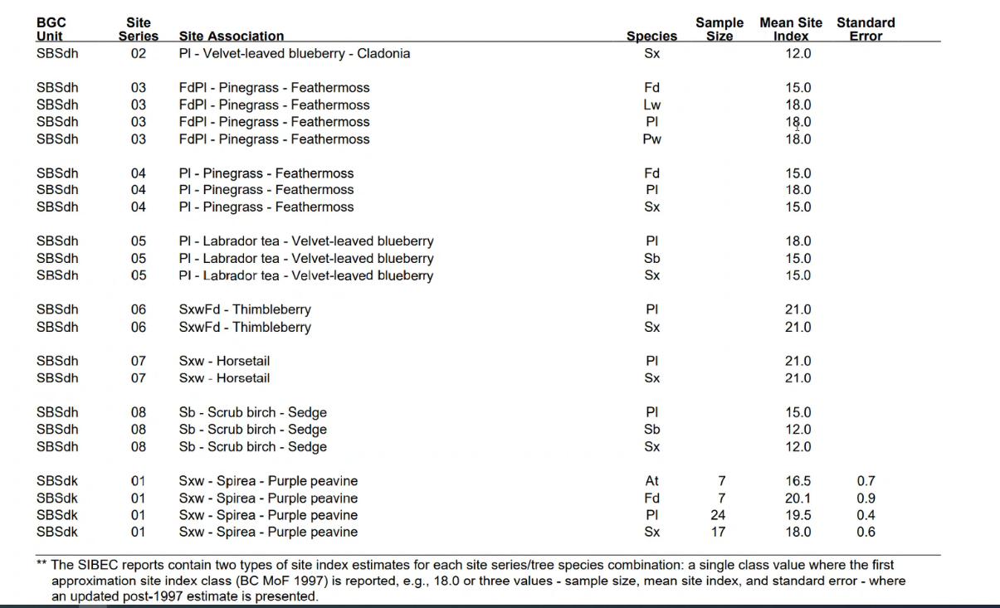

--- 
title: "PSPL Processing 2023"
author: "Dave Waddell, RPF, MF"
date: "2023-03-27"
site: bookdown::bookdown_site
description: |
  This is the bookdown for PSPL Processing
  The HTML output format for this example is bookdown::gitbook,
  set in the _output.yml file.
---

# PSPL 

The Provincial Site Productivity Layer (PSPL) is used to provide the site index by species for preparation of the provincial managed stand yield tables (MSYTs).

The processing of PSPL has changed for 2023. The revised process reflects how an input to Batch TIPSY would handle site index conversion to provide site index for species that are missing a site index.

Note that the PSPL data was prepared by Jeff Kruys (under contract).  
Version 8, released oct 2021 

The Provincial Site Productivity Layer (PSPL)

https://www2.gov.bc.ca/gov/content/industry/forestry/managing-our-forest-resources/forest-inventory/site-productivity/provincial-site-productivity-layer

PSPL documentation:

https://bcgov.github.io/FAIB_PSPL/

## Site Productivity (SP) Points

A set of points are generated that cover the province in a regular grid

- a grid point is only generated where the point covers a “forested” area
- a site index is assigned to this point in a hierarchical manner

1. PEM/TEM + SIBEC
	- PEM/TEM map the spatial site series
	- SIBEC provides the site index look up tables for the site series
	- SIBEC currently does not cover all site series found in PEM/TEM
	- PEM/TEM does not cover the entire province
	- only the approved PEM/TEM are used for TSR

2. BIOPHYSICAL Model

	- where SIBEC is not complete or a PEM/TEM is not available, a biophysical model is used to generate site index
	- the biophysical model is expanded by +/-5% beyond the range of the climate association to encompass more than the original range.
	- beyond this, NULL site index values are generated, leading to some SP points appearing in the data with NULL values
	- based on climate BC data 2002 
	
## Features missing PSPL points
	
	

The species that are assigned a site index are those for which there is
an ecological site association for those species. This can sometimes
differ from species that are actually planted on the site. This can lead
to gaps. These missing site index values can cause an ERROR and
termination of Batch TIPSY during processing. In these cases,
alternative methods of supplying a site index are used preemptively to
prevent processing errors.

# PSPL Process Overview

The following figure represents the process used to mill in missig site index values for the AR2022 processing.

# Create feature\_id means

1.  Import all PSPL points from GDB into PostgreSQL
2.  Import the veg_comp_lyr_r1_poly geometry and feature_id into PostgreSQL
2.  Intersect all PSPL points with the veg comp feature\_id 
3.  Derive Mean values for each feature\_id

Example 

| feature_id | at_si | ba_si | ...| sw_si | sx_si | yc_si |
|:-----|:-----|:-----|:-----|:-----|:----|:-----|
| 1810686 | 18.2 |  | | | 15.0| 
| 2001498 |  |  | | 19.3 | |

There are 22 site index by species column in the PSPL data.  

# Create BEC zone/subzone means

1.  Group Data from the feature values into BEC zone/subzone
2.  Derive group mean

# Missing Site Index Values

Fill in missing values associated with the species list for each feature

## Species required for each feature\_id

The MSYT process generates a species list for each feature\_id that includes both the current and future assignment of species composition. 

For the 2 features listed above the species that require site index are:

| feature_id |          species|
|:------------|:---------------------------|
|    1810686 | {At,Fdi,Lw,Pl,Py,Sw}|
|    2001498 | {At,Cwi,Fdi,Hwi,Pl,Pw,Sw}|

And the PSPL mean data has the following site index values.

| feature_id | at_si | cw_si | fd_si | hw_si | lw_si | pl_si | pw_si | py_si | sw_si| sx_si |
|:------------|:-------|:-------|:-------|:-------|:-------|:-------|:-------|:-------|:-------|:---|
|    1810686 |  18.2 |       |  17.2 |       |    \*   |  17.1 |       |  15.0 | \*| 15.0 |
|    2001498 |    \*   |  18.7 |  17.1 |  15.0 |       |  17.1 |   \*    |       | \*| 19.3 |

Feature 1810686, has site index values are missing for Lw and Sw.  
Feature 2001498, has site index values are missing for At, Pw and Sw.  

It is important to note that while Sw site index is missing for both features, a site index is supplied for Sx.  
This will be used as one of the first site index substitutions as Sx is commonly used in the PSPL as opposed to the more specific Sw, Se or Ss.

Since there are only site index equations for Se, Sw and Ss these will be substituted base on BEC.   
 
##  Find where species is missing a site index

Join the species list to the feature site index data.  
Find where a species is missing a site index and tag them.

At this point, this table summarizes how many features have complete site index for species:

|src	|n	|pct|
|:--|:--|:--|
|PSPL	|1039574	|18|
|Total	|5526737	||

Table 1. Base PSPL Missing Site Index values

Initially, the raw PSPL has site index values for all required species for 18%.

# Run the Spruce Substitution

Substitute Sx site index under the following conditions

Se = Sx where BEC = 'ESSF'  
Sw = Sx where BEC != 'ESSF' and BEC is not coastal  
Ss = Sx where BEC is coastal (CDF, CWH, MH)   

Update the tags for missing where the Spruce Substitution has filled the site index.

|src	|n	|pct|
|:--|:--|:--|
|PSPL	|1039574	|18|
|Spruce Conversion	|667801	|12|
|Total	|5526737	||

Table 2. After SX substitutions

After substituting for Sx, the valid site index percentage has increased to 30%.

# Use SIndex site conversions

Site tools SIndex provides a standard set of coefficients for site index conversions.  These are provided in the appendix. 

The next step is to apply the site index conversions only for those species that have a missing site index.  This procedure is used so that chaining of the site index conversions are minimized.

Again, update the tags for missing where the Spruce Substitution has filled the site index.

# Additional Site Index conversions

The use of the standard SIndex conversion coefficients has shown that there are some species conversions that are missing.  The following substitutions are being used to address this. 

## Interior Western Cedar (Cw)

If there is no site index provided for Cw and the BEC zone is NOT in
CWH, CDF, or MH, then it is assigned using the White Spruce site index:

-   cw\_si = sw\_si

## Sitka Spruce

The standard PSPL process runs a set of site index conversion equations
only once. That is, the use of a converted site index is avoided if
possible. Under certain conditions, this may leave site index values
missing. In the case of Sitka Spruce (Ss), the conversion equation for
Western Hemlock(Hw) is used a second time to fill in gaps:

-   ss\_si = -4.943820220 + 1.248439450 \* hw\_si

## White Pine

Similar to Sitka Spruce, White Pine can end up with missing site index
values. In this case, two equations were required to fill in missing
site index values, one for the coast and one for the interior:

-   pw\_si = ss\_si (coastal)
-   pw\_si = fd\_si (interior)

## Yellow Pine

Also similar to Sitka Spruce, Yellow Pine can end up with missing site
index values. In this case, Douglas Fir site index is used:

-   py\_si = fd\_si

## Alder

The first discussions around missing site index values for Alder (Dr)
suggested a direct site index substitution using Douglas Fir. An
examination of these site indices lead to a discussion that possibly the
values were too high. Limited data from RPB (George Harper) suggested
the following:

-   Coast dry: bec\_zone in (‘CWH’,‘CDF’,‘MH’) and bec\_subzone in
    (‘ds’,‘db’,‘xm’)
    -   dr\_si = fd\_si \* 0.55
-   Coast Wet: bec\_zone in (‘CWH’,‘CDF’,‘MH’)
    -   dr\_si = fd\_si \* 0.73

## Shore Pine

There are occurrences of low density Shore Pine (Pl in coastal BEC).
These are being treated as Non Commercial or are being removed it they
are the last species in the list.

Examples:

CWH wh, Pl with planted density = 20 removed from planted species list

BEC zone CDF, CWH or MH, if natural species 5 is Pl, replace with Ncc

Ncc is not counted in the reported merchantable volume, but occupies
space in terms of overall site occupancy.

## After SIndex and augmented conversions

|src	|n	|pct|
|:--|:--|:--|
|PSPL	|1039574	|18|
|Spruce Conversion	|667801	|12|
|SIndex Conversion(1)	|3249093	|58|
|Total	|5526737	||

Table 3. After SIndex conversions where a species is mising a site index.

The valid site index percentage has increased to 88%.

# Use BEC zonal means

At this point, we are still missing site index for approx 10% of the features.  The PSPL zonal BEC means will be used to substitute where missing, but they need to be processed further before use. The Spruce Substitution is run first, followed by the SIndex conversions.  In this case, a species missing approach is not used and the SIndex conversions are run in a brute force manner. 

The updated BEC means are then used to substitute where a species is missing a site index in the feature based data.

Again, update the tags for missing.  

At this point, there should be no missing site index values.  

|src	|n	|pct|
|:--|:--|:--|
|PSPL	|1039574	|18.8|
|Spruce Conversion	|667801	|12.1|
|SIndex Conversion(1)	|3249093	|58.8|
|BEC Conversion	|570269	|10.3|
|Total	|5526737	|100|

Table 4. After BEC substitutions.

# BEC Substitutions

At this point, there may still be missing values in the features. To overcome this, the
recommendations from Regional Ecologist were used to build an acceptable
BEC substitution (crosswalk) table.

<table>
<thead>
<tr class="header">
<th>Missing BEC</th>
<th>Substitution</th>
</tr>
</thead>
<tbody>
<tr class="odd">
<td>BWBSvk</td>
<td>BWBSwk</td>
</tr>
<tr class="even">
<td>CWHwm</td>
<td>CWHvm</td>
</tr>
<tr class="odd">
<td>ESSFdvw</td>
<td>ESSFdv</td>
</tr>
<tr class="even">
<td>ESSFmvp</td>
<td>ESSFmv</td>
</tr>
<tr class="odd">
<td>ESSFmww</td>
<td>ESSFmw</td>
</tr>
<tr class="even">
<td>ESSFmz</td>
<td>ESSFun</td>
</tr>
<tr class="odd">
<td>ESSFwcp</td>
<td>ESSFwc</td>
</tr>
<tr class="even">
<td>MHun</td>
<td>MHmm</td>
</tr>
<tr class="odd">
<td>MSdv</td>
<td>MSxv</td>
</tr>
<tr class="even">
<td>SBSmv</td>
<td>SBSun</td>
</tr>
<tr class="odd">
<td>SWBmk</td>
<td>BWBSdk</td>
</tr>
<tr class="even">
<td>SWBmks</td>
<td>BWBSdk</td>
</tr>
<tr class="odd">
<td>SWBun</td>
<td>BWBSdk</td>
</tr>
<tr class="even">
<td>SWBvk</td>
<td>BWBSdk</td>
</tr>
</tbody>
</table>

Table 1. BEC Substitution table

# Input Requirements

-   PSPL point sets by TSA
-   VRI (geometry and feature\_id in raster form)
-   BEC(x) (associated with PSPL)
-   TSA updated for additions and depletions

# Processing requirements

-   Spatially intersect PSPL with VRI features
-   Spatially intersect BEC(x) with VRI features
-   Generate mean feature\_id based PSPL site index
-   Generate BEC for each VRI feature (most points)

# Appendices

## SIndex conversion coefficients

SIndex contains a set of conversion equations.  These equations were directly translated from C to R.  

The following table documents the conversions coefficients. 

The conversion equation is of the form:

s1si = b0 + b1 \* s2si 

|s1|s2|b0|b1|
|--|--|------------|-----------|
|at|sw|-4.768112309|1.253446979|
|at|sx|-4.768112309|1.253446979|
|at|se|-4.768112309|1.253446979|
|at|bl|-7.216706405|1.457496490|
|at|pl|-7.452123778|1.362442366|
|at|fd|-12.846637615|1.700742166|
|ba|hw|-1.977317550|0.986193290|
|ba|ss|1.928007878|0.789940825|
|ba|sx|1.928007878|0.789940825|
|ba|cw|-0.738658778|1.033530568|
|ba|fd|-2.403353051|0.886587768|
|bl|sw|1.680000000|0.860000000|
|bl|sx|1.680000000|0.860000000|
|bl|pl|0.474311930|0.917431190|
|bl|at|4.951440000|0.686108000 |
|bl|fd|-0.221100912|0.981651373|
|bl|lw|-1.360550450|0.954128438|
|bl|sb|-3.497247692|1.436697244|
|cwc|hw|-1.198473280|0.95419847|
|cwc|ba|0.714694652|0.967557249|
|cwc|ss|2.580152661|0.764312974|
|cwc|sx|2.580152661|0.764312974|
|cwc|fd|-1.610687019|0.857824425|
|fdc|hw|0.480533930|1.112347050|
|fdc|cw|1.877641825|1.165739708|
|fdc|ba|2.710789765|1.127919909|
|fdc|ss|4.885428248|0.890989987|
|fdc|sx|4.885428248|0.890989987|
|fdi|pl|0.708411210|0.934579440|
|fdi|bl|0.225233640|1.018691590|
|fdi|hw|4.560000000|0.887000000|
|fdi|sw|4.750000000|0.737000000|
|fdi|sx|4.750000000|0.737000000|
|fdi|at|7.553548000|0.587978600|
|fdi|lw|-0.690000000|0.983000000| 
|fdi|sb|-3.337383186|1.463551403 |
|hwc|cw|1.256000000|1.048000000|
|hwc|ba|2.005000000|1.014000000|
|hwc|ss|3.960000000|0.801000000|
|hwc|sx|3.960000000|0.801000000|
|hwc|fd|-0.432000000|0.89900000|
|hwi|fd|-5.140924460|1.127395720|
|hwi|sw|0.214205210|0.830890646|
|hwi|sx|0.214205210|0.830890646|
|hwi|pl|-4.342264694|1.053640861|
|hwi|lw|-5.918827507|1.108229993|
|lw|fd|0.701932860|1.017294000|
|lw|bl|1.425961536|1.048076921|
|lw|pl|1.923076920|0.961538460|
|lw|sw|3.817307686|0.884615383|
|lw|sx|3.817307686|0.884615383|
|lw|hw|5.340793500|0.902339778|
|lw|sb|-2.239423073|1.505769228|
|pl|sw|1.970000000|0.920000000|
|pl|sx|1.970000000|0.920000000|
|pl|hw|4.121200000|0.949090000|
|pl|at|5.469680000|0.733976000|
|pl|bl|-0.517000000|1.090000000|
|pl|fd|-0.758000000|1.070000000|
|pl|lw|-2.000000000|1.040000000|
|pl|sb|-4.329000000|1.566000000|
|sb|pl|2.764367820|0.638569600|
|sb|lw|1.487228620|0.664112384|
|sb|fd|2.280332063|0.683269472 |
|sb|bl|2.434227337|0.696040864|
|sb|sw|4.022349932|0.587484032|
|sb|sx|4.022349932|0.587484032|
|ss|hw|-4.943820220|1.248439450|
|ss|ba|-2.440699123|1.265917602|
|ss|cw|-3.375780271|1.308364544|
|ss|fd|-5.483146062|1.122347066|
|sw|pl|-2.141304350|1.086956520|
|sw|at|3.804000000|0.797800000|
|sw|hw|-0.257801914|1.203527813|
|sw|bl|-1.953488370|1.162790700|
|sw|lw|-4.315217390|1.130434781|
|sw|fd|-6.445047490|1.356852100|
|sw|sb|-6.846739125|1.702173910|

## Species Specific Site Curves

TASS II Specific Parameters:

Species are generally calibrated to specific site curves, however mixing and matching can be done with caution. Each species defaults to its own curve; where there are multiple site curves per species the default is labelled. 

The following table contains all available site curves with the suggested species codes. See Appendix B: References for tree species code definitions and site curve references.  

site_curve must be one of the following Site Curve values:

|Species Code	|Site Curves|
|:---|:---|
|Acb	|ACB_HUANGAC|     
|Act	|ACT_THROWERAC    |
|At	|AT_NIGH          |
|Ba	|BA_NIGH          |
|Bl	|BL_CHENAC        |
|Bp	|BP_CURTISAC      |
|Cwc	CWC_NIGH       |  
|Cwi	CWI_NIGH        | 
|Dr	|DR_NIGH   |
|Ep	|EP_NIGH    |      
|Fdc	|FDC_BRUCEAC      |
|Fdi	|FDI_THROWERAC    |
|Hm	|HM_MEANSAC       |
|Hwc	|HWC_WILEYAC   |   
|Hwi	|HWI_NIGH       |  
|Lw	|LW_NIGH          |
|Pj	|PJ_HUANGAC       |
|Pli	|PLI_THROWER (default), PLI_NIGH|
|Pw	|PW_CURTISAC      |
|Py	|PY_NIGH          |
|Sb	|SB_NIGH          |
|Se	|SE_NIGH          |
|Ss	|SS_NIGH          |
|Sw	|SW_GOUDIE_PLAAC (default), SW_GOUDIE_NATAC, SW_NIGH|

Source:

MFLNROD 2021. Command Documentation for the Tree and Stand Simulator (TASS) Versions II and III. Internal draft. Forest Analysis and Inventory Branch. Ministry of Forests, Lands, and Natural Operations and Rural Development.  Revised December 2021. 241p

## Species Volume Curves

|Input Code	|FIZ \*	|Site Index Curve	|Volume Curve	|
|:---|:---|:---|:---|
|A	|X	|AT	|AT	|
|AC	|X	|ACT	|AT	|
|ACB	|X	|ACB	|AT	|
|AT	|X	|AT	|AT	|
|B	|C	|BA	|HWC|	
|B	|I	|BL	|SW	|
|BA	|C	|BA	|HWC|	
|BA	|I	|BA	|SW	|
|BG	|C	|BA	|HWC|	
|BG	|I	|BL	|SW	|
|BL	|C	|BL	|HWC|	
|BL	|I	|BL	|SW	|
|C	|C	|CWC	|CWC|	
|C	|I	|CWI	|CWI|	
|CT	|X	|ACT	|AT	|
|CW	|C	|CWC	|CWC|	
|CW	|I	|CWI	|CWI|	
|CWC	|C	|CWC	|CWC|	
|CWC	|~	|CWC	|CWC|	
|CWI	|I	|CWI	|CWI|	
|CWI	|~	|CWI	|CWI|	
|CY	|C	|CWC	|CWC|	
|CY	|I	|CWI	|CWI|	
|D	|X	|DR	|DR	|
|DR	|X	|DR	|DR	|
|F	|C	|FDC	|FDC	|
|F	|I	|FDI	|FDI	|
|FD	|C	|FDC	|FDC	|
|FD	|I	|FDI	|FDI	|
|FDC	|C	|FDC	|FDC	|
|FDC	|~	|FDC	|FDC	|
|FDI	|I	|FDI	|FDI	|
|FDI	|~	|FDI	|FDI	|
|H	|C	|HWC	|HWC|	
|H	|I	|HWI	|HWI|	
|HM	|X	|HM	|HWC|	
|HW	|C	|HWC	|HWC|	
|HW	|I	|HWI	|HWI|	
|HWC	|C	|HWC	|HWC|	
|HWC	|~	|HWC	|HWC|	
|HWI	|I	|HWI	|HWI|	
|HWI	|~	|HWI	|HWI|	
|L	|X	|LW	|FDI|	
|LW	|X	|LW	|FDI|	
|PL	|X	|PLI	|PLI	|
|PLI	|X	|PLI	|PLI	|
|PLI	|~	|PLI	|PLI	|
|PW	|X	|PW	|FDI|	
|PY	|X	|PY	|FDI|	
|S	|C	|SS	|SS	|SS|
|S	|I	|SW	|SW	|SW|
|SB	|X	|SB	|SW	|
|SE	|X	|SE	|SW	|
|SS	|X	|SS	|SS	|SS|
|SW	|X	|SW	|SW	|SW|
|YC	|C	|CWC	|CWC|	
|YC	|I	|CWI	|CWI|
	
* FIZ: C for coast, I for interior, X for both, ~ for unspecified.

For more information on recommended species substitutions, see the TIPSY help pages.

## SIBEC

**SIBEC first estimates vs Second**

First estimates were exactly that, estimates. An initial estimate with no sampling. If a site index is indicated in the data as 12.0 it came from the first estimate as they were generated to the nearest meter.

Second estimates had sampling and therefore carry data to the decimal meter. Based on ground samples.

